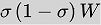
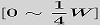
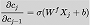

[TOC]

# 自然语言处理

## 001 列出几种文本特征提取算法

答：文档频率、信息增益（ＩＧ是一种基于信息熵的评估方法，定义了特征词在文本中出现与不出现的信息熵之差）
、互信息、
X^2统计（开方校验中特征词与文本类别之间服从χ２分布，其值越高，特征词与类别之间相关性越大）、TF-IDF某个词或短语在一篇文章中出现频率高，但在其它类中很少出现，
则认为该词或短语对本篇文章很重要，说明该词具有
很好的分类能力、word2vec（词向量嵌入）

## 002 RNN为什么会梯度消失？

RNN使用的激活函数时tanh，该函数的梯度最大为1，而更多时候都是趋近于0，当求导得到的jacobian矩阵存在一些元素趋近于0，多个矩阵相乘，会使得梯度很快消失。

为什么不将tanh换成ReLU呢？这样不就可以解决梯度消失了吗？RNN中直接把激活函数换成ReLU会导致非常大的输出值
因为RNN中权值不跟新，每次h输出值都会累加上一次的值，导致不断在增大

## 003 LSTM怎么能解决梯度消失问题？

 LSTM通过门机制来解决了这个问题，LSTM相对普通RNN多了加和，也就是多了三个门（输入门，输出门，遗忘门）为避免梯度消散提供了可能。
RNN两个状态求导满足（tanh激活函数类似）： ，求导绝对值范围为：
而lstm中cell状态公式：，于是，需要连乘的项可表示为：，该值范围在0~1之间，但是在实际参数更新中，
可以通过控制bias比较大，使得该值接近于1；在这种情况下，即使通过很多次连乘的操作，梯度也不会消失，仍然可以保留"长距"连乘项的存在。

- [ ] TODO

## 005 如何利用深度学习计算语义相似度？

- [ ] TODO

## 006 介绍一下Word2vec，CBOW和Skip-gram的区别是什么？

- [ ] TODO

## 007 GRU和LSTM、RNN的区别是什么？

- [ ] TODO

## 008 LSTM用来解决RNN的什么问题？

- [ ] TODO

## 009 如何判断word2vec的效果好坏？

- [ ] TODO

## 参考资料

- [2018-暑期实习生-自然语言处理算法岗-面试题](<https://blog.csdn.net/qq_28031525/article/details/80028055>)

